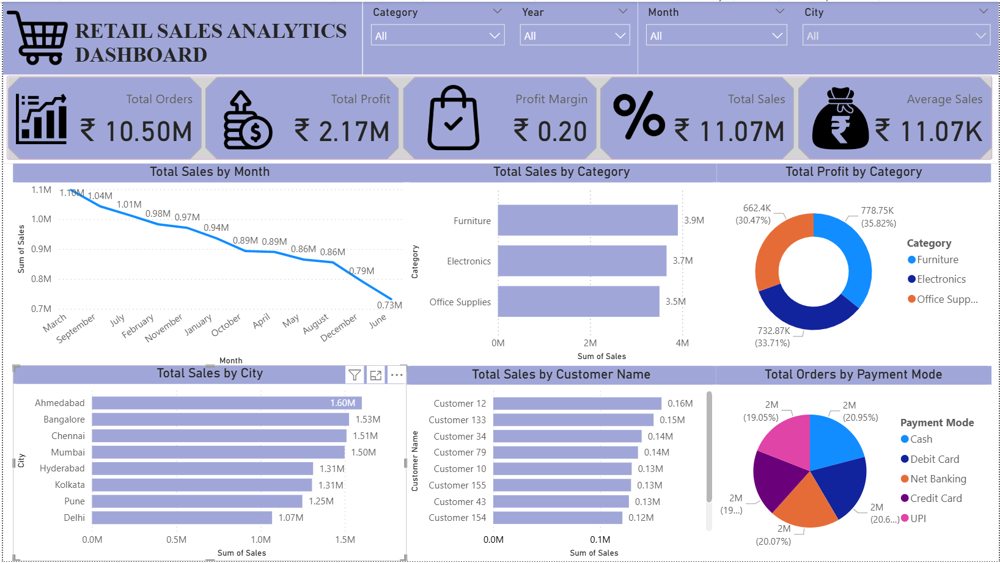

# 📊 Retail Sales Analytics Dashboard

## 📌 Project Overview

This project focuses on analyzing retail sales data using Microsoft Excel and Power BI. The objective is to identify sales trends, monitor business performance, and provide actionable insights through an interactive dashboard.

---

## 🛠️ Tools & Technologies

- Microsoft Excel
- Power BI Desktop
- DAX (Data Analysis Expressions)
- Pivot Tables
- Data Visualization

---

## 📂 Dataset

The dataset contains approximately **1,000 retail sales records** with the following fields:

- Order ID
- Order Date
- Customer Name
- City
- State
- Category
- Sub Category
- Product Name
- Quantity
- Sales
- Profit
- Discount
- Payment Mode

---

## 🧹 Data Cleaning (Excel)

- Removed duplicate records
- Checked for missing values
- Formatted dates and currency
- Created calculated columns:
  - Month
  - Year
  - Quarter
  - Profit %
  - Sales Category

---

## 📈 Power BI Dashboard

### KPI Cards

- Total Sales
- Total Profit
- Total Orders
- Average Sales
- Profit Margin

### Visualizations

- Monthly Sales Trend (Line Chart)
- Sales by Category (Bar Chart)
- Profit by Category (Donut Chart)
- Sales by City (Horizontal Bar Chart)
- Top 10 Customers by Sales
- Orders by Payment Mode

### Interactive Slicers

- Year
- Month
- Category
- City

---

## 📊 Business Insights

- Electronics generated the highest sales.
- Bangalore was one of the top-performing cities.
- UPI was the most preferred payment mode.
- Top customers contributed significantly to overall sales.
- Monthly sales trends helped identify peak business periods.

---

## 📷 Dashboard Preview



---

## 📁 Project Structure

```
Retail-Sales-Analytics/
│
├── Retail_Sales_Analytics.pbix
├── Retail_Sales_Cleaned.xlsx
├── Dashboard.png
├── README.md
```

---

## 🚀 Skills Demonstrated

- Data Cleaning
- Data Analysis
- Data Visualization
- Power BI
- DAX
- Excel
- Business Intelligence
- Dashboard Design

---

## 👨‍💻 Author

**Prajwal Valmiki**

LinkedIn: *(https://www.linkedin.com/in/prajwal-valmiki)*

GitHub: *(https://github.com/Prajwalvalmiki)*